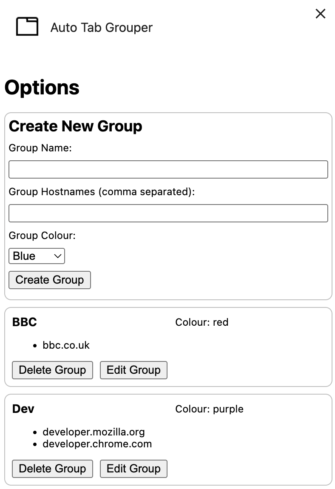

# Chrome Tab Organiser Browser Extension

Allows you to automatically organise your Chrome tabs into groups, making it easier to manage and navigate through multiple open tabs.

## Features
- Automatically groups tabs based on their hostnames.
- Provides a user-friendly interface to manage tab groups.

## Installation
1. Clone the repository:
   ```bash
   git clone https://github.com/schleising/chrome-tab-organiser.git
    ```
2. Open Chrome and navigate to `chrome://extensions/`.
3. Enable "Developer mode" in the top right corner.
4. Click on "Load unpacked" and select the cloned repository folder.

## Usage
- The extension will automatically group tabs based on their hostnames.
- You can manage the groups through the extension's options interface.



## Contributing
Contributions are welcome! Please fork the repository and submit a pull request with your changes.